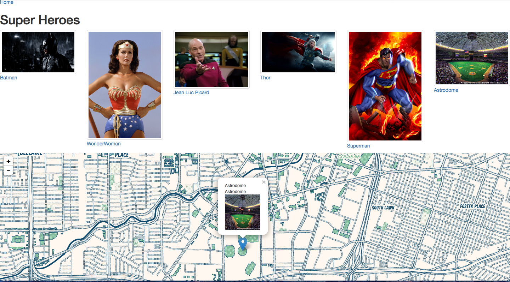

#Iron Yard Houston: Crash Course

We're going to build a map of Heroes

But really, this will show:

* Creating databases and records
* Administration Systems
* User Interface Coolness
* Getting it online

## Following Along

If you have Rails installed, you can clone this repo. 

For most of you, click below and you can use "Nitrous" to hack with. That's what
I'll be doing in the class.

1. Sign up with a free account
2. start the box, when ready click "IDE"
3. In the terminal, type `cd workspace/heroes; bundle; rake db:setup`
4. ... wait ...
5. type `rails s`
6. Click Preview, and choose 'Port 3000'

## Commands I use

* `rails s` will start rails and do everything. We can preview on port 3000

## Cool sites for this

* [Unsplash](https://unsplash.com/) Photos
* [HipsterIpsum](http://hipsum.co)

## Books

* [RubyWizardry](http://www.nostarch.com/rubywizardry)
* [JavaScript for Kids](http://www.nostarch.com/jsforkids)
* [RailsTutorial](https://www.railstutorial.org/)
* [Learn to Program](http://www.amazon.com/Program-Second-Edition-Facets-Series/dp/1934356360)

## Gems we use

* LeafletJS
* geocoder
* rails-admin

